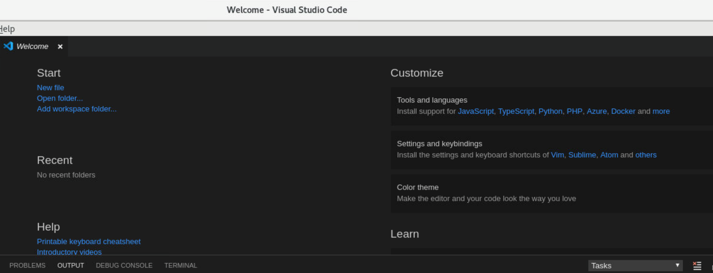
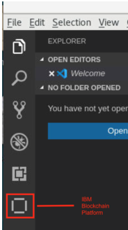
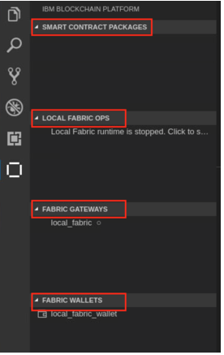

**1. How to access this service?**

Once you register for event you will get access to Hyperledger Developer Desktop and its resources . You need to click on [Service Catalog](https://developer.ibm.com/openlabstest/service-catalog). Here you will find “Try for free” option to get access to this service.

-------------------- 

**2.	What is Try for free account?**

These is trial account which will give access to registered service and its resources. Its free for all registered users and you can attempt trial version as many times as you want. Once you click on try for free it will start timer of 3 hours. If time is lapsed you can go back to catalog and again attempt for same.

--------------------

**3.	What is Launch Desktop option? What it is providing to me?**

Launch Desktop option will provide an access to IBM® Blockchain Platform Visual Studio (VS) Code extension. Once you click on it, it will show a password which needs to connect to VNC. You can also see the ID and password details once you click on key icon, it will show you all details.

Once you click on launch it provide option to connect to platform: 

--------------------

**4. How to access VSCode?**

Once you logged in to “noVNC” , click on application --> Accessories --> Visual Studio Code

  4.1	Overview of Visual Studio Code
  
  
  
  4.2	On the left menu bar, click on IBM Blockchain Platform menu
  
  
  
  4.3	View switch to IBM Blockchain Platform view, displayed with features Smart Contract Packages, Local Fabric Ops, Fabric Gateway, and Fabric Wallets
  
 
 
  -------------------- 
  
**5.	How to copy code to terminal or from terminal ?**
  
You can use clipboard option to copy code to terminal from desktop or vice versa.

----------------------

**6. How to disconnect from terminal?**

At the terminal at left hand side you will see one small side bar with multiple option . One of the option is there to disconnect:

---------------------- 

**7.	Side bar panel options:**

  
  

